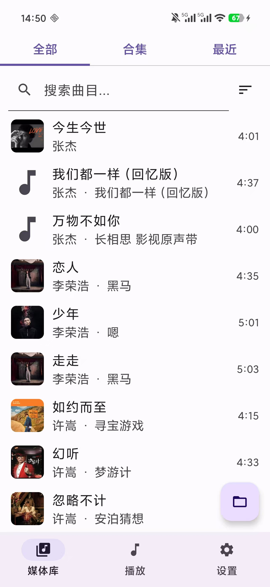
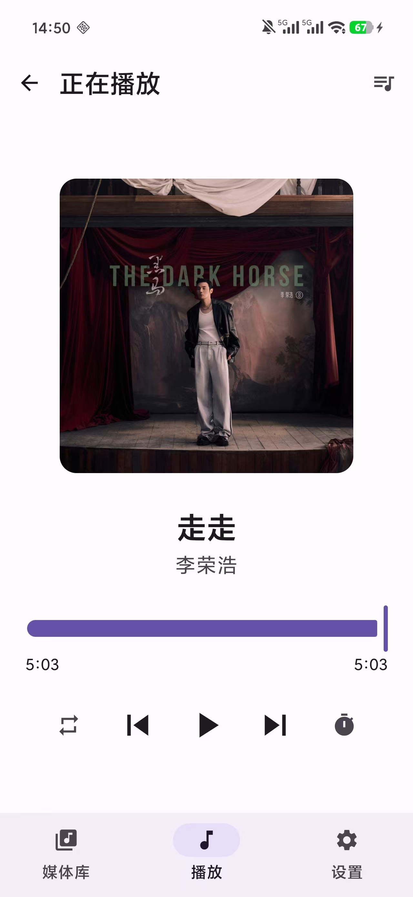
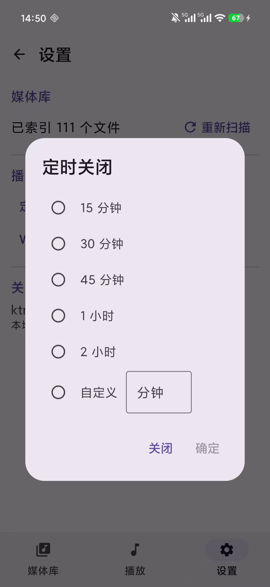

# ktmp

一个本地优先、离线的 Android 音视频播放器。它不依赖流媒体账号或云端音乐库：你的文件、播放列表与播放记录都保留在设备上。

> 当前版本：0.0.1 · 最低 Android 8.0（API 26）

## 截图

<table>
  <tr>
    <td></td>
    <td></td>
    <td></td>
  </tr>
</table>

## 功能
- **定时关闭：受到哔哩哔哩启发，这是我最需要的功能**
- 扫描并播放设备中的本地音频与视频文件
- 按歌曲、专辑、歌手、文件夹浏览和搜索媒体库
- 创建、重命名、排序和管理“合集”（本地播放列表）
- 播放队列、播放历史、循环/随机播放
- 支持从文件或目录导入媒体
- Wi-Fi 传歌：电脑和手机连接同一网络后，在浏览器中上传文件
  - 文件保存到系统 `Music/ktmp`（视频为 `Movies/ktmp`）目录
  - 可在网页选择已有合集或新建合集，上传后自动加入
- 播放队列和进度会在应用重启后恢复

## Wi-Fi 传歌

1. 在应用的“设置”中选择“WiFi 传歌”，启动服务器。
2. 让电脑与手机接入同一个局域网。
3. 在电脑浏览器打开应用显示的地址。
4. 选择目标合集（或点击“新建”），拖放或选择音视频文件上传。

上传完成后，文件会进入系统共享媒体目录，也能被其他音乐应用访问。

## 构建

环境要求：

- JDK 17
- Android SDK Platform 36
- Android SDK Build-Tools（由 Android Studio 或 SDK Manager 安装）

```bash
./gradlew :app:assembleDebug
```

生成的 APK 位于 `app/build/outputs/apk/debug/app-debug.apk`。

## 技术栈

- Kotlin、Jetpack Compose、Material 3
- Media3 / ExoPlayer
- Room、DataStore、WorkManager
- Hilt
- Coil

## 权限说明

- 媒体读取权限：扫描和播放设备上的音频、视频。
- 网络与 Wi-Fi 状态权限：仅用于局域网 Wi-Fi 传歌。
- 前台服务与通知权限：播放时显示通知与控制项。

## 开发状态

ktmp 目前专注于本地、离线音乐库体验。欢迎通过 Issue 提交问题和功能建议。

## 许可证
